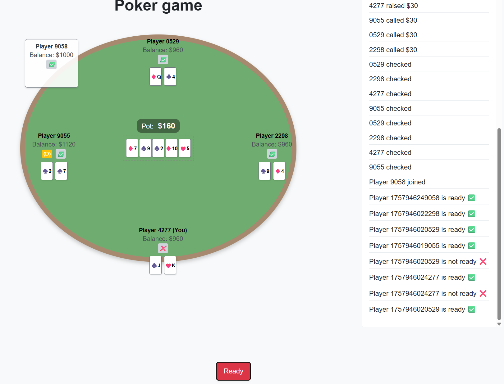

# Real-time poker game with design patterns

This project is a real-time, multiplayer poker game, developed as a 2nd-year university coursework. This application provides a web-based interface and uses WebSockets for instand communication between players. The primary goal of this project was to apply and demonstrate a deep understanding of variuos software patterns to build a robust, scalable and maintainable application.  

## 📸Screenshots

A quick look at the gaming process from the player's perspective:

|                                          |                                                    |                                                  |
|:----------------------------------------:|:--------------------------------------------------:|:------------------------------------------------:|
|             **Waiting room**             |                    **Preflop**                     |                **Raising a bet**                 |
|  |                      |        |
|               **Showdown**               |          **New player joined**                     |               **New game started**               |
|          |  |  |

## ✨Features

- **Real-time multiplayer gameplay:** Play poker in real time though a different tabs in a web browser. Each opened tab represents a new player
- **WebSocket communication:** The backend and frontend communicate through WebSockets, ensuring that all players have the most up-to-date game state instantly
- **Web Interface:** A dynamic and interactive user interface built with HTML, CSS and JavaScript that updates in real time based on game events
- **Automatic hand evaluation:** The game automatically detects and ranks poker hands from a Royal Flush to a High Card 

## 🛠️ Tech Stack

- **Backend:**
  - **FastAPI:** A modern, high-performance Python web framework used to handle HTTP requests and WebSocket connections
  - **Uvicorn:** A lightning-fast ASGI server that runs the FastAPI application
  - **Pydantic:** Used for data validation and ensuring that the data sent between the server and clients is correctly structured
- **Frontend:**
  - **HTML, CSS, JavaScript**
- **Testing:**
  - **Pytest:** Used for unit testing the hand evaluation logic to ensure its accuracy

## 🏛️ Architectural Design & Patterns

The core of this project is its architecture, which is built upon several key design patterns. Each pattern was chosen to solve a specific problem and contribute to a robust and scalable codebase.

- **Bridge:** This pattern decouples the core game logic (`Game`) from the communication interface (`AbsGameHandler`). This makes the system flexible, allowing the game to be adopted for different platforms (e.g. mobile, console)
- **Observer:** The `ConnectionManager` acts as a "Publisher" that manages a list of "Subscribers" (`Websocket` connections). When a game event occurs, the `ConnectionManager` notifies all connected clients about it
- **Builder:** A `ConcreteGameBuilder` is used to construct the complex `Game` object step by step
- **State + Template Method:** The game's flow is managed by a State pattern, with classes like `PreFlopState` and `FlopState` representing different stages of a poker round. Within these states, a **Template Method** (`run_betting_round`) defines the overall structure of a betting round, while allowing individual states to override specific steps (hooks) to handle variations on rules
- **Command:** Player actions (Call, Check, Raise, Fold) are encapsulated as objects using the Command pattern
- **Chain of Responsibility:** This pattern is used to evaluate a player's hand starting with the strongest possible hand (`RoyalFlushEvaluator`) and proceeds down a chain of handlers for progressively weaker hands
- **Strategy:** On the client-side this pattern is used to handle incoming WebSocket messages


## 🚀 How to run

1. Clone the repository:
```
git clone https://github.com/svyrydov-ihor/poker-game.git
cd poker-game
```

2. Create a virtual environment:
```
python -m venv .venv
source .venv/bin/activate  # On Windows use `.venv\Scripts\activate`
```

3. Install dependencies:
```
pip install -r requirements.txt
```
   
4. Run the application:
```
uvicorn app.main:app --reload
```

5. Open a web browser and open several tabs with the url: `http://127.0.0.1:8000` to start playing